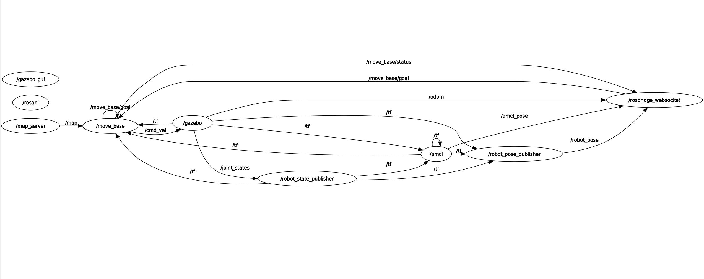

# Cloud Robotics - A web based Interface for Robotics Control and Navigation
A web application built using React JS to control Robot.

The web interface is composed of the following components:

- **About.jsx**: Contains information about the project and its purpose.
- **Body.jsx**: The main body of the web application.
- **Connection.jsx**: Displays the connection status of the robot.
- **Footer.jsx**: The footer section of the web application.
- **Header.jsx**: The header section of the web application.
- **Home.jsx**: The landing page of the web application.
- **Map.jsx**: Displays the navigation map and allows the user to set the robot's goal location.
- **RobotState.jsx**: Displays live information about the robot's position, orientation, and linear/angular velocity.
- **Teleoperation.jsx**: Provides teleoperation controls, including a web-based joystick and an emergency stop button.

## Youtube Video Demo Link


### Prerequisites

Before you begin, make sure you have the following software installed on your machine:

- Node.js (v14.x or later) Node.js v20.x was used
- npm (v7.x or later)
- ROS (Robot Operating System) ROS Noetic

  ### ROS Packages used
- ROSBridge Package
- Turtlebot3 navigation
- Turtlebot3 gazebo
- robot_state_publisher


### Installing Dependencies

To install the required dependencies, navigate to the project directory and run the following command, this would install the dependencies in the ```package.json``` file:

```bash
npm install
```
### Rqt_Graph showing ROSNODES and Topics
 


### Reference

[ROS Web Navigation](https://www.udemy.com/course/ros-web-nav/).
